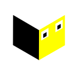

<p align="center">
  
</p>

<h1 align="center">Rigid</h1>

<p align="center">
  <strong>The human-in-the-loop toolkit for AI-built software</strong>
</p>

<p align="center">
  AI writes the code. You sculpt it into something real.
</p>

<p align="center">
  <a href="https://rigid.dterminal.net">Website</a> •
  <a href="#features">Features</a> •
  <a href="#installation">Installation</a> •
  <a href="#license">License</a>
</p>

---

## What is Rigid?

Rigid is the missing layer between AI-generated code and production-ready software. AI agents can generate entire applications—they scaffold features, write tests, and deploy infrastructure. But what they produce is a rough draft, not a finished product.

The gap between "generated" and "shippable" is where human judgment lives. Rigid fills that gap with tools built for a new kind of developer: **the sculptor, not the scribe.**

<p align="center">
  
</p>

## Features

### Explore
Map what the agents built. Navigate every surface, trace every decision, and maintain a living exploration log of your inherited codebase.

<p align="center">
  
</p>

### Document
Capture findings as you learn. Annotate screenshots, record video evidence, and create a traceable narrative from chaos to clarity.

<p align="center">
  
</p>

### Deliver
Ship with confidence. Validate edge cases, verify intent, and close the loop on what matters before your users feel the gaps.

<p align="center">
  
</p>

## More Capabilities

- **Screenshot Annotation** - Mark up screenshots with precision to document bugs and issues
- **Video Annotation** - Browse through recordings and add annotations for errors
- **AI Collaboration** - An assistant that understands your project context
- **Architecture Diagrams** - Review and document system architecture visually
- **Kanban Boards** - Track features and tasks being worked on
- **24+ Themes** - Customize the interface to match your preferences

<p align="center">
  
</p>

## Installation

Download Rigid for your platform from [rigid.dterminal.net](https://rigid.dterminal.net#download).

### Supported Platforms

- **macOS** (Apple Silicon)
- **Windows** (x86_64)
- **Linux** (x86_64)

## Development

This project is built with:

- [Tauri](https://tauri.app/) - Desktop application framework
- [React](https://react.dev/) - UI framework
- [TypeScript](https://www.typescriptlang.org/) - Type-safe JavaScript

### Getting Started

```bash
# Clone the repository
git clone https://github.com/porkytheblack/taka.git
cd taka

# Install dependencies
cd app
pnpm install

# Run in development mode
pnpm tauri dev
```

## License

Rigid is licensed under the [GNU Affero General Public License v3.0 (AGPL-3.0)](LICENSE).

This means you are free to:
- Use the software for any purpose
- Study how the software works and modify it
- Distribute copies of the software
- Distribute your modified versions

Under the condition that you:
- Disclose source code when distributing
- License modifications under AGPL-3.0
- State changes made to the code
- Provide network users access to source code

---

<p align="center">
  A product by <a href="https://dterminal.net">dterminal</a>
</p>

<p align="center">
  
</p>
